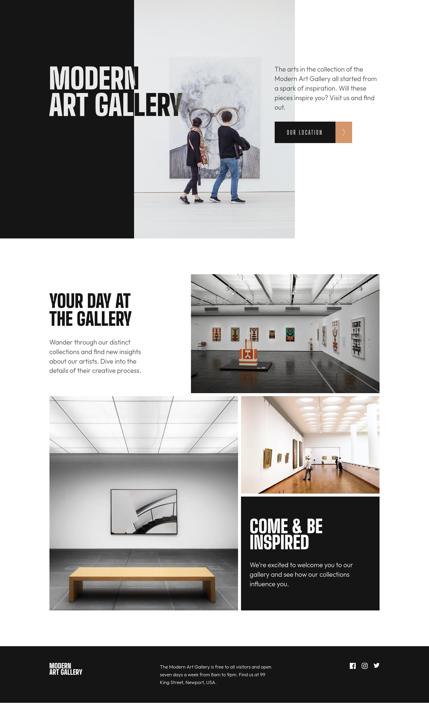
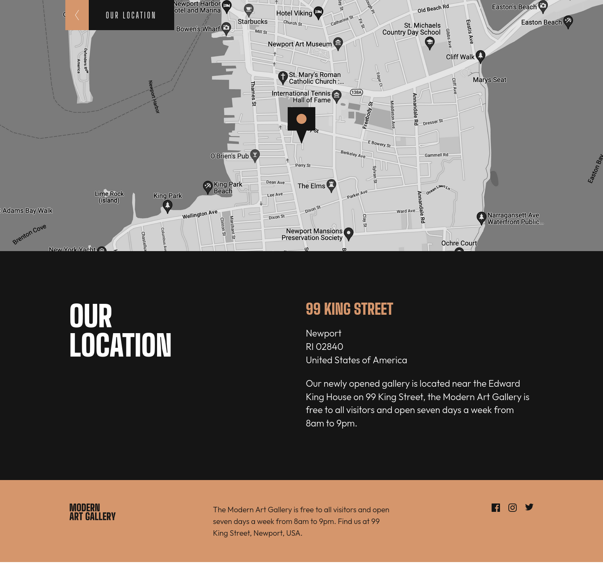
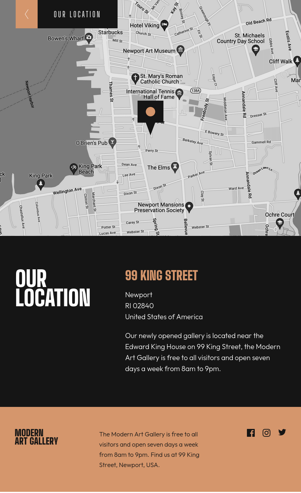
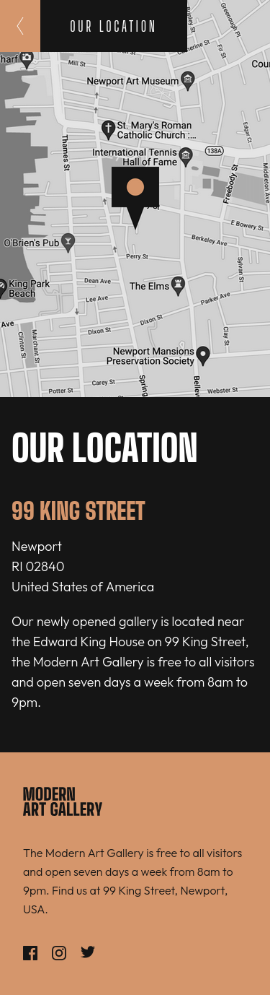

# Frontend Mentor - Art gallery website solution

This is a solution to the [Art gallery website challenge on Frontend Mentor](https://www.frontendmentor.io/challenges/art-gallery-website-yVdrZlxyA). Frontend Mentor challenges help you improve your coding skills by building realistic projects.

## Table of contents

- [Overview](#overview)
  - [The challenge](#the-challenge)
  - [Screenshot](#screenshot)
  - [Links](#links)
- [My process](#my-process)
  - [Built with](#built-with)
  - [What I learned](#what-i-learned)
  - [Useful resources](#useful-resources)
- [Author](#author)
- [Acknowledgments](#acknowledgments)

## Overview

### The challenge

Users should be able to:

- View the optimal layout for each page depending on their device's screen size
- See hover states for all interactive elements throughout the site

### Screenshot

### Links

- Solution URL: [Github](https://github.com/VirginiaPat/art-gallery-website-main.git)
- Live Site URL: [Netlify](https://art-gallery-virgi.netlify.app)

## My process

### Built with

- Semantic HTML5 markup
- CSS custom properties
- Tailwind
- Flexbox
- Mobile-first workflow

### What I learned

It is the first project I am using Tailwind, so definitely I learned a lot of new things.

### Useful resources

- [CSS FilterConverter](https://cssfilterconverter.com/) - This helped me to transform specific colors to filters. I used it to change the colors of the social media icons on hover state.
- [Tailwind documentation](https://tailwindcss.com/docs/installation/tailwind-cli)

## Author

- Frontend Mentor - [@VirginiaPat](https://www.frontendmentor.io/profile/VirginiaPat)
- Github - [VirginiaPat ](https://github.com/VirginiaPat)
- Netlify - [VirginiaPat](https://app.netlify.com/teams/virginia-patrika/sites)

## Acknowledgments
